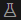
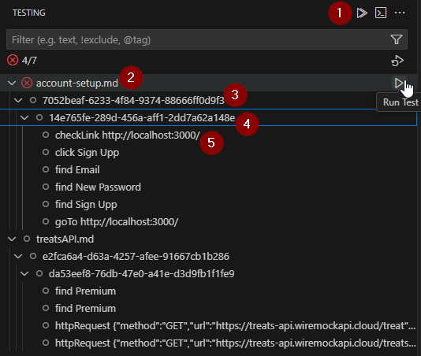
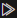
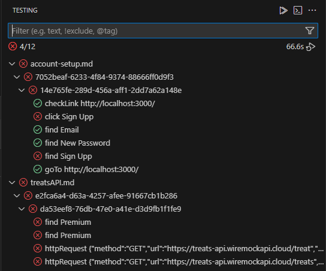
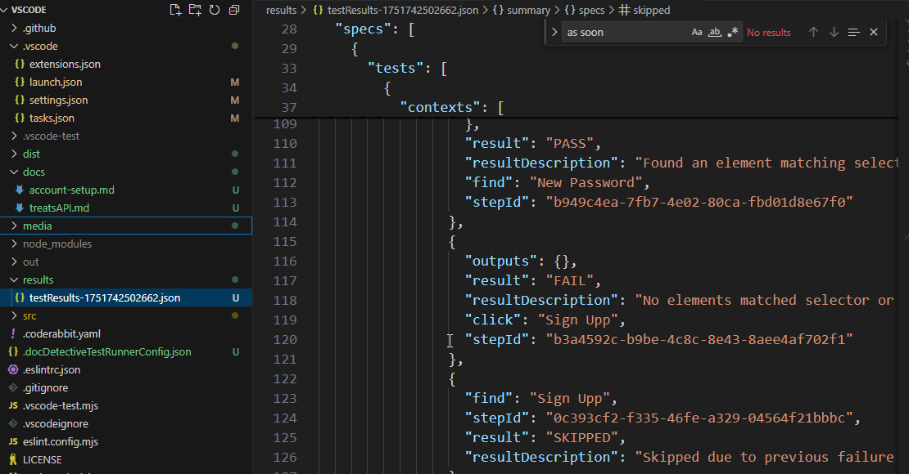
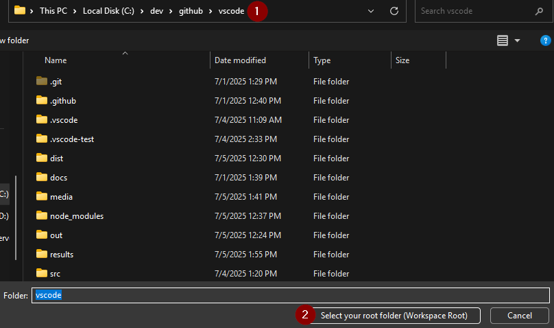
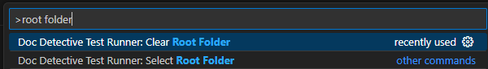

# Doc Detective Test Runner VSCode Extension

The Doc Detective Test Runner VSCode Extension integrates the [Doc Detective](https://doc-detective.com) documentation testing framework directly into your Visual Studio Code environment. This extension helps you detect, view, and run documentation tests embedded in your content files, making it easier to keep your documentation accurate and up-to-date.

## Features

- **Real-time Test Detection**: Automatically detects Doc Detective tests in your configured docs folder
- **Sidebar Integration**: View and run detected tests using the VS Code test runner panel () in the activity bar
- **Interactive Test Explorer**: Navigate through detected tests with collapsible steps for easy viewing

## How It Works

Doc Detective is a documentation testing framework that helps validate documentation against real product behavior. This extension uses `doc-detective-resolver` to scan your documentation files for embedded tests and displays them in the test runner sidebar panel. From there, you can run tests for one or more files.
    
## Requirements

- Visual Studio Code v1.100.0 or higher

## Installation

### Via VS Code Marketplace

1. Open VS Code
2. Go to the Extensions view (Ctrl+Shift+X)
3. Search for "Doc Detective"
4. Click Install

### Manual Installation

If you prefer to install the extension manually:

1. Download the VSIX file from the [latest release](https://github.com/doc-detective/vscode/releases/latest)
2. In VS Code, go to the Extensions view (Ctrl+Shift+X)
3. Click the "..." menu in the top right of the Extensions view
4. Select "Install from VSIX..." and choose the downloaded file

## Using Doc Detective Test Runner Extension
### Preparing documents
1. Place one or more documents in the configured `docs` folder.
2. Click the Test Runner icon () in the activity bar
3. Review the detected tests displayed in the test runner

### Test discovery
* As soon as you complete the [setup](#setup) steps below, the Doc Detective Test Runner extension will automatically scan files in the configured `docs` folder for:
- Inline tests using HTML comments or markdown comment syntax
- Test specifications in YAML or JSON format
- Documentation with embedded test steps

### Viewing tests
* Within VS Code, you can access the Doc Detective test runner bly cliking on the VS Code test runner panel () in the activity bar
* You will now see any tests that have been discovered displayed within the test runner. For example, here I have tests for 2 markdown files: 

()

### Running Tests
To run the tests, click the `play` button at the desired level.

> **NOTE**: currently the Doc Detective Test Runner only supports running tests at the specification level or higher (e.g. - you can click `run` on an individual test step, but it will run all test steps for the current file).

### Test levels (from highest to lowest)
| Number | Test Level       | Button
| :-:    | :------:         | :---:
| 1      |  All             |           | 
| 2      |  File            | 
| 3      |  Specification   | 
| 4      |  Test            | 
| 5      |  Step            | 

### Viewing Results
* The test runner will be updated with PASS/FAIL results

* To see more detailed results, you can view the results file within your configured results folder:

## Setup
### Background
Visual Studio Code uses the concept of the "workspace" to define where the "root" of a user's work area is along with other folders and items relative to it.

In order to ensure that the Doc Detective Test Runner implements the workspace concept in a manner that is easy to use, we have opted for a "Select your root folder once and never again (unless you want to change it)" approach.

### First time launch
The first time you run the Doc Detective Test Runner, it will prompt you for the location of your root workspace folder.

> **Important**: It is recommended that you select the `vscode` folder where the extension lives at this step, as this determines where VS Code will start looking for relative paths like your `docs` and `results` folders

### Clearing/reselecting the root folder
If you make a mistake when setting the root folder or want to change it, here is how you can clear this selection:

1. Access the Command Pallete
   * Windows: `Ctrl+Shift+P`
   * Mac: `Cmd+Shift+P`
1. Type "root folder"
1. Choose `Doc Detective Test Runner: Clear Root Folder` from the dropdown list.

### Setting the root folder (after first launch)
To set the root folder manually, repeat steps 1 & 2 above, but this time choose `Doc Detective Test Runner: Select Root Folder` from the list.

## Configuration

### Config File
At the root of the of the workspace for the Doc Detective Test Runner is the `vscode` folder. Within this folder you will find `.docDetectiveTestRunnerConfig.json`.

This configuration file contains 2 folder settings which are ***relative to the root vscode folder***:
| Setting       | Description       | Default Value
| :-:           | :------           | :--
| docsFolder    |  folder where documents containing testable assertions are stored                              |   docs
| resultsFolder |  folder where test results are stored | results

### Configuration example
* Suppose that I launch the Doc Detective Test Runner extension for the first time, and, when prompted, I set my root folder to: `C:\github\vscode`
* This means that by default, Doc Detective is going to look for testable assertions within documents in the `C:\github\vscode\docs` folder; and it will store test results in the `C:\github\vscode\results` folder.

## Related Projects

Doc Detective has multiple components that work together:

- [Doc Detective](https://github.com/doc-detective/doc-detective): The main CLI tool for running documentation tests
- [Doc Detective Resolver](https://github.com/doc-detective/resolver): Library for detecting tests in documentation files
- [Doc Detective Core](https://github.com/doc-detective/doc-detective-core): Core testing functionality
- [Doc Detective Common](https://github.com/doc-detective/doc-detective-common): Shared utilities and components

## Learn More

- [Doc Detective Documentation](https://doc-detective.com)
- [GitHub Repository](https://github.com/doc-detective/vscode)
- [Discord Community](https://discord.gg/2M7wXEThfF)

## Contributing

Interested in contributing to this extension? Check out the [Doc Detective GitHub organization](https://github.com/doc-detective) to learn more about the project and how to get involved.

---

**Made with ❤️ by the Doc Detective team**
